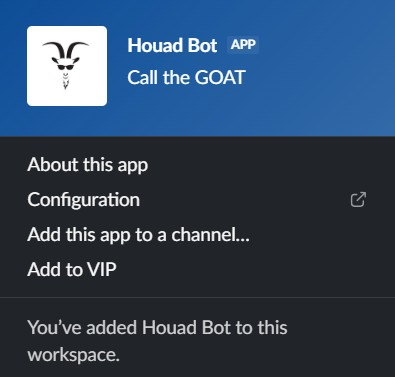

<h1 align="center">🤖Houad Bot</h1>

## Table of content

- [Demo](#demo)
- [How it works](#how-it-works)
- [Built With](#built-with)
- [Author](#author)

## Demo

Try it out in **#bot-spam** → https://hackclub.enterprise.slack.com/archives/C0P5NE354

View the project on **Stardance** → https://stardance.hackclub.com/projects/29947

## How it works

Open Your Slack chat in hackclub and enter one of these Available Commands:

- `/houad-help`: (displays all available commands)
- `/houad-call`: (calls the goated bot)
- `/houad-catfact`: (displays a random cat fact)

## Built With

[HackClub Stardance guide](https://stardance.hackclub.com/missions/slack-bot/guide)

## Author

Me : [xtrawalo](https://github.com/xtrawalo)

